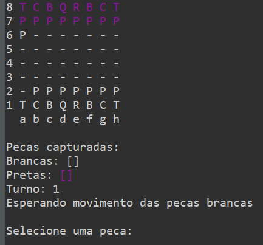

# Projeto de Xadrez em Java

Este é um projeto de implementação do jogo de xadrez em Java, que pode ser executado através do terminal. Ele foi desenvolvido como parte de um exercício de programação para demonstrar conceitos de orientação a objetos em Java.

## Funcionalidades

- O jogo de xadrez é completamente funcional, permitindo que dois jogadores joguem uma partida completa.
- As regras padrão do xadrez são implementadas, incluindo movimentos legais, capturas, promoção de peões, roque, en passant e xeque-mate.
- A interface é baseada em texto, permitindo a interação do usuário através do terminal.

## Requisitos do Sistema

- JDK (Java Development Kit) instalado no sistema.
- Um ambiente de terminal para executar o jogo.

## Como Executar

1. Clone este repositório para o seu sistema local.
2. Navegue até o diretório raiz do projeto.
3. Compile os arquivos Java usando o seguinte comando:

``` 
java application/Program
```

5. O jogo será iniciado no terminal e você poderá começar a jogar imediatamente.

## Como Jogar

- Após iniciar o jogo, as instruções serão exibidas no terminal.
- Cada jogador deve fazer seus movimentos seguindo a notação de xadrez padrão (por exemplo e2 para selecionar o peao e e4 para mover a peça para a posição desejada).
- O jogo continuará alternando entre os jogadores até que ocorra um xeque-mate.
- Ao final do jogo, o resultado será exibido no terminal.

  

## Estrutura do Projeto

O projeto está organizado da seguinte forma:

- `ChessMatch.java`: O arquivo principal que contém a lógica do jogo.
- `Board.java`: Classe responsável pela representação do tabuleiro e suas operações.
- `Piece.java`: Classe abstrata que representa uma peça de xadrez genérica.
- `King.java`, `Queen.java`, `Rook.java`, `Bishop.java`, `Knight.java`, `Pawn.java`: Classes que representam as diferentes peças do jogo.


## Exemplo de como o jogo se dispõe



